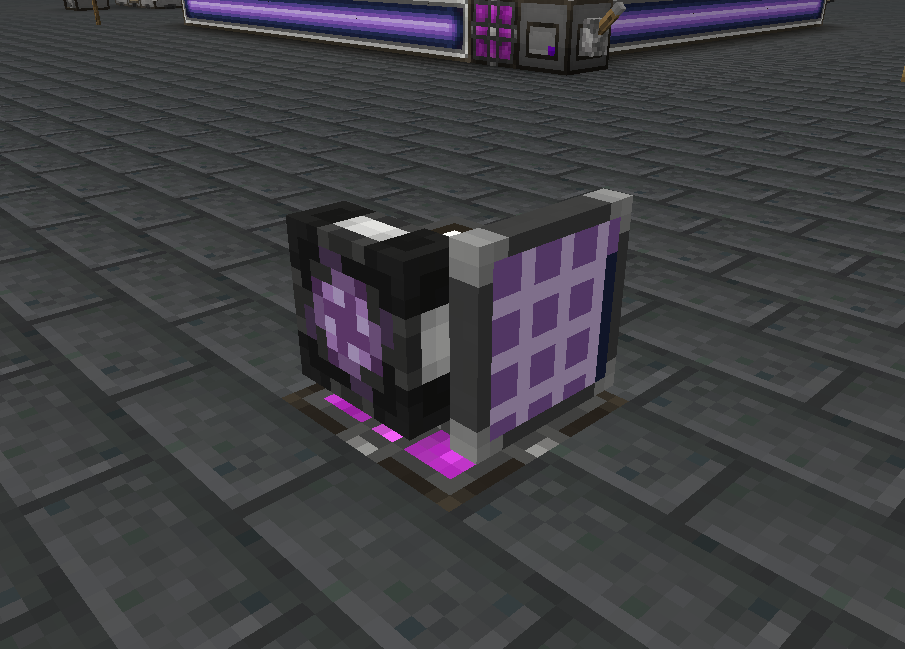
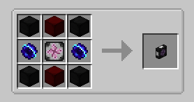
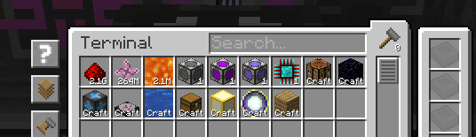
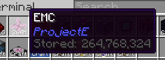
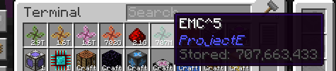

# AppliedE
[![CurseForge Total Downloads][badge_curseforge]][curseforge]
[![Modrinth Total Downloads][badge_modrinth]][modrinth]

A Minecraft mod made as an add-on to both [Applied Energistics 2][ae2] and [ProjectE][projecte] providing more
tightly-coupled integration between the two mods. Unlike conventional add-ons integrating the two together, AppliedE 
works by turning ProjectE's *EMC* into a distinct "key type" able to be displayed, reported and manipulated by an ME
network and converted into items upon request via AE2's auto-crafting facilities.

Currently, the mod is in **alpha stages**. Beware of any critical bugs, particularly on multiplayer servers, and please
report them on the [issue tracker][issues] as they arise.

## Features
### ME EMC Module
Retrieves all transmutation/EMC knowledge from the player who placed down the module to provide ME networks with
information on stored EMC and transmutable items. Can be placed anywhere at all on the network to function.

Multiple modules may be placed down on one network by any number of different players / knowledge providers, but only
one module per knowledge provider will contribute to the stored EMC figure and available "craftable" known items. If
multiple knowledge providers are employed by the modules on a network, any inserted and extracted EMC will be equally
(as is possible) distributed among all providers.

The module also includes additional safeguards to prevent overflow issues in ME networks, by adding a "tier" system to
the EMC stored on a network based on subsequent powers of an arbitrarily large number of EMC units.

### ME EMC Interface

*Work in progress, coming soon...*

## License
All code is licensed under [LGPLv3][lgpl-v3], in adherence to the same license used by Applied Energistics 2 and with
some code borrowed from AE2 itself.

All assets are licensed under [CC BY-NC-SA 3.0][by-nc-sa-3.0], in adherence to the same license used by AE2 and with
most deriving from AE2's and ProjectE's own assets. Some assets have been provided externally as courtesy of
[Sea_Kerman](https://modrinth.com/user/Sea_Kerman).

<!-- Images -->
[badge_curseforge]: https://img.shields.io/badge/dynamic/json?color=e04e14&label=CurseForge&style=for-the-badge&query=downloads.total&url=https%3A%2F%2Fapi.cfwidget.com%2F1009940&logo=curseforge
[badge_modrinth]: https://img.shields.io/modrinth/dt/SyKS54UY?color=5da545&label=Modrinth&style=for-the-badge&logo=modrinth

<!-- Links -->
[curseforge]: https://www.curseforge.com/minecraft/mc-mods/appliede
[modrinth]: https://modrinth.com/mod/appliede
[ae2]: https://github.com/AppliedEnergistics/Applied-Energistics-2
[projecte]: https://www.curseforge.com/minecraft/mc-mods/projecte
[issues]: https://github.com/62832/AppliedE/issues
[lgpl-v3]: https://www.gnu.org/licenses/lgpl-3.0.en.html
[by-nc-sa-3.0]: https://creativecommons.org/licenses/by-nc-sa/3.0/
